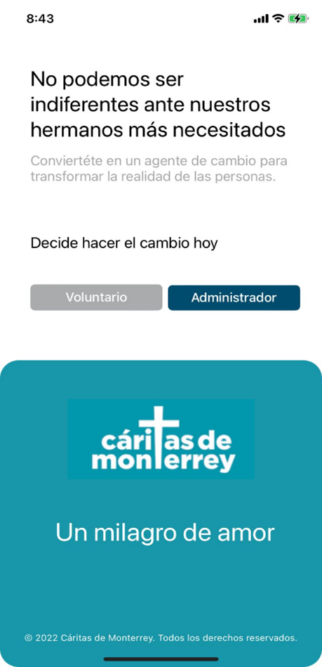
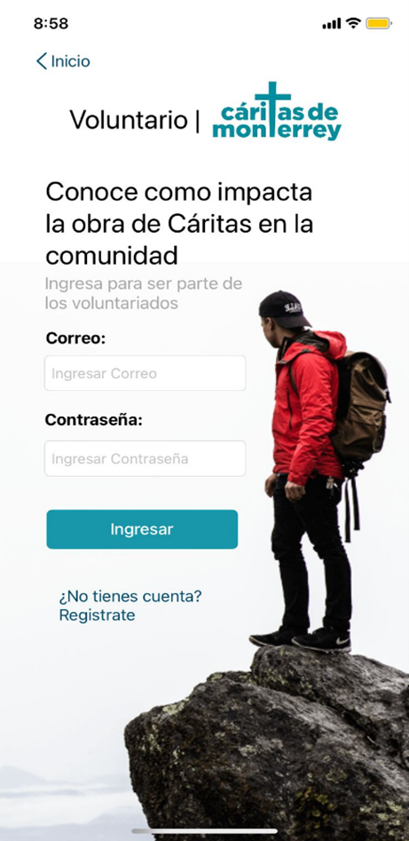

# PROYECTOS
Semana Tec 12

En este apartado se mencionarán algunos proyectos, ya sea personales o escolares que se han hecho a lo largo de esta etapa de ENFOQUE de la carrera.

## Pastelería Maria´s

En este caso el objectivo de este proyecto era crear una red para un emprendimiento chico/mediano desde 0, tomando en cuenta los equipos, tipos y la forma en que se manejaría la red.
Para el proyecto hicimos una simulación en la que utilizamos Packet Tracer.
Participe como encargado de seguridad de los equipos y establecimiento de la distribución de la red.

En este caso, se ve como un router, con el nombre de VPN y se debe a que en ese momento no se tenían los conocimientos para simularlo, sin embargo, se estableció una conexión de una manera similar.

## CaritApp

Este proyecto fue una aplicación relacizada junto con el socioformador *Cáritas* en la que se pedía una aplicación que permitiese un registro más efectivo y manejo de las horas de servicio de los vluntarios.
Para este proyecto se hizo uso de swift, MySQL Server; siendo esta una apicación de iOS.
Participé con el rol de programador de front-end y encargado de seguridad.

 , 

## Comisión del Hermano Mayor
El proyecto manejaba al socioformador *Comisión del Hermano Mayor* en el que se pedía una mejora del sistema de la página que poseían actualmente e inclusive rediseñarlo.
En este proyecto se hizo uso de HTML, CSS, Azure.
Yo participe con el rol de programador Full-Stack 
